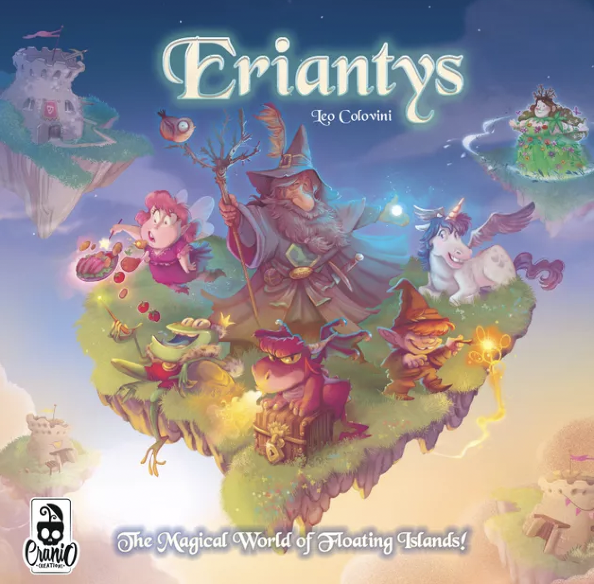

# PROVA FINALE DI INGEGNERIA DEL SOFTWARE 2021-2022

*Eriantys* is an Italian board game, for 2-4 players, created by Leo Colovini.
It is a game full of strategy and twists. Plan your moves carefully and try to control the moves of your opponents. With three different game modes, including a team game, Eriantys offers always different and interesting matches. Also, if you play with the expert variant, you can use the fantastic abilities of the special characters. *Manage your Eriantys’ school and compete with other wizards to increase your fame!*

The *target* of the projet is the implementation of a distributed system composed by a single server capable of managing one game at a time and multiple clients (one per player) that can participate in only one game at a time. The game has been implemented according to the architectural pattern MVC (Model-View-Controller) and a TCP network using sockets.

## DOCUMENTATION:
In this paragraph will be shown the documentation of the project:
## UML
The [initial UML](deliveries/initial_uml.png) features an initial and  general idea of the game, later the diagram has been modified according to a more defined implementation for reaching the [final UML](link).

## Network Protocol
The network protocol(link) describes the communication between the server and the client.

## JavaDoc
JavaDoc(link) provides a descripition of the classes and the methos.

## TOOL, PLUGINS AND EXTERNAL LIBRARIES USED
Intellij IDEA, JUnit, Maven, JavaFX + Scene Builder, Github

## FUNCTIONALITIES
|FUNCTIONALITIES|IMPLEMENTED|
|-----|:---:|
|Complete Rules| **X** |
|Socket Connection| **X** |
|Cli| **X** |
|Gui| **X** |
|**ADVANCED FUNCTIONALITIES**|**IMPLEMENTED**|
|Character Card| **X**  |
|4 – Player Game| **X** |

## JAR
The following jars allow to launch the game as descriped 
CLI 
GUI 

## DEVELOPERS:
PAOLO GAMBARIN, ANTONINO GATTUSO, REBECA MERSAM

